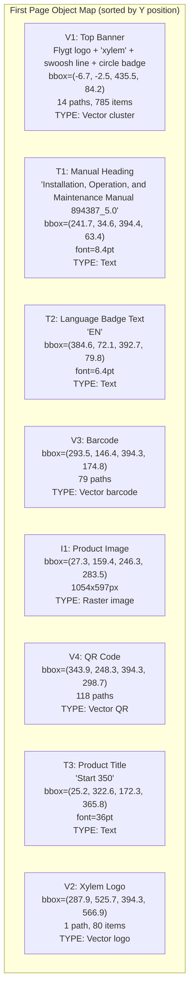

# PDF Layout Comparison System — Implementation Plan (v2)

## What I Found on the First Page

I ran deep analysis against all 11 PDFs (English + 10 translations). Here is every object on the first page:



### Critical Discovery: V1 is ONE Inseparable Cluster

The **Flygt logo**, **"xylem" text beneath it**, **decorative swoosh line**, and **language circle badge** are all physically connected vector paths. Even with gap=0.1pt, they form a single cluster because the swoosh line physically connects the logo area to the circle badge area.

**This is actually GOOD** — it means the entire top banner (logo + swoosh + badge circle) is one atomic visual unit. If ANY part changes (logo swap, line removal, badge move), the comparison catches it.

---

## Proven Comparison Strategy (Tested & Verified)

### Per-Object Comparison Results (EN vs DA)

| Object | What it is | Method | Result | Notes |
|--------|-----------|--------|--------|-------|
| **Page Size** | 419.53 × 595.28 | Exact match | ✅ PASS | Identical |
| **V1** | Flygt logo + swoosh + badge circle | SSIM after text masking | ✅ **SSIM = 1.000** | MD5 differs (redaction artifacts), but SSIM is perfect |
| **V2** | Xylem logo (bottom-right) | MD5 hash of rendered region | ✅ **Hash exact match** | No text overlap → MD5 works |
| **V3** | Barcode | pyzbar decode | ✅ Decodes OK | Visual differs (different doc#) → **decode presence, not hash** |
| **V4** | QR Code | pyzbar decode | ✅ Decodes OK | Visual differs (different URL) → **decode presence, not hash** |
| **I1** | Product image | MD5 of raw image bytes | ✅ **Hash exact match** | Same image embedded in both |
| **T1** | Manual heading | Position Y + font size | ✅ Y=34.6, font=8.4 | Text content differs (expected) |
| **T2** | Language code | Presence of 2-char uppercase | ✅ EN / DA both found | |
| **T3** | Product title | Largest font block | ✅ Y=322.6, font=36 | Works for "Start 350" and "スタート350" |

> [!IMPORTANT]
> **Key insight**: For vector graphics that overlap text regions (V1), **SSIM is the only reliable method**. MD5 fails because text redaction leaves microscopic pixel artifacts, but SSIM correctly reports 1.0 (visually identical).

---

## Edge Cases Analyzed

### Logo & Branding Changes

| Scenario | What Happens | Detection |
|----------|-------------|-----------|
| Flygt → ABC Pumps | V1 cluster changes in both EN and translated | ✅ SSIM compares them — same logo in both → PASS |
| Xylem → NewBrand | V2 cluster changes in both | ✅ MD5/SSIM compares them — same in both → PASS |
| Logo changed in EN but not translated | V1/V2 differs between PDFs | ✅ SSIM < threshold → FAIL |
| Logo position moves | Cluster bbox shifts | ✅ Position comparison detects shift |
| New 3rd logo added | New cluster appears in both PDFs | ✅ Cluster count mismatch or new cluster matched → PASS if in both |
| Logo removed from translated | Cluster in EN, missing in translated | ✅ Unmatched cluster → FAIL |

### Format Changes

| Scenario | What Happens | Detection |
|----------|-------------|-----------|
| SVG logo → Raster logo | Vector cluster disappears, raster image appears | ✅ Full-page SSIM catches visual change |
| Raster logo → SVG logo | Same as above reversed | ✅ Full-page SSIM catches it |
| New stylesheet version | Different cluster layout | ✅ All comparisons are relative (EN vs translated), not absolute |
| Color scheme change | Pixel values change in rendered region | ✅ SSIM compares visual similarity |

### Text & Content Changes

| Scenario | What Happens | Detection |
|----------|-------------|-----------|
| Japanese title スタート350 | Largest-font detection still works | ✅ Font size match, Y position match |
| Very long translated heading | Text bbox shifts but font stays same | ✅ Font size match; Y tolerance allows minor shift |
| Missing language code | No 2-char uppercase text in badge region | ✅ Presence check → FAIL |
| New language code (e.g., UK, ZH-CN) | Still matches 2-char uppercase pattern | ✅ Language-agnostic detection |

### Structural Changes

| Scenario | What Happens | Detection |
|----------|-------------|-----------|
| Barcode removed | pyzbar decode returns nothing | ✅ Presence check → FAIL |
| QR code removed | pyzbar decode returns nothing | ✅ Presence check → FAIL |
| Product image swapped | Different image hash | ✅ MD5 mismatch → FAIL |
| Product image resized | Different bbox dimensions | ✅ Size comparison → FAIL |
| Extra decorative element | Remaining graphics SSIM drops | ✅ SSIM < threshold → FAIL |

---

## Architecture

```mermaid
graph TB
    subgraph "Extraction Layer"
        E1["extract_page_model(pdf_path)"]
        E1 --> PM["Page Model (flat dict)"]
    end

    subgraph "Page Model"
        PM --> PS["page_size: (w, h)"]
        PM --> TI["title: {bbox, font_size}"]
        PM --> MH["manual_heading: {bbox, font_size}"]
        PM --> VE["version: '5.0'"]
        PM --> DN["doc_number: '894387' + length"]
        PM --> LA["language: 'EN'"]
        PM --> BC["barcode: {decoded, bbox}"]
        PM --> QR["qr: {decoded, bbox}"]
        PM --> PI["product_image: {bbox, hash}"]
        PM --> VC["vector_clusters: [{bbox, path_count, item_count}]"]
        PM --> RI["raster_images: [{bbox, hash}]"]
    end

    subgraph "Comparison Layer"
        C1["compare_first_page(eng_model, trans_model)"]
        C1 --> R1["10 structured checks"]
        C1 --> RG["remaining_graphics_check()"]
        RG --> R2["Per-cluster SSIM + full-page SSIM"]
    end

    subgraph "Remaining Graphics Algorithm"
        RG1["1. Render both pages at 300 DPI"]
        RG2["2. Redact ALL text (white fill)"]
        RG3["3. Mask barcode & QR regions (white fill)"]
        RG4["4. Per-cluster comparison via SSIM"]
        RG5["5. Full-page SSIM of masked images"]
        RG1 --> RG2 --> RG3 --> RG4 --> RG5
    end

    subgraph "Output Layer"
        O1["Console report"]
        O2["Excel report (Report.xlsx)"]
    end
```



---

## Proposed Changes

### Component 1: Extractor

#### [MODIFY] [extractor.py](file:///c:/Xylem%20Project/Spot%20check/extractor.py)

**Complete rewrite** with language-agnostic, structure-based detection:

| Detection | Current (Broken) | New (Proven) |
|-----------|-----------------|--------------|
| Title | `startswith("Start")` | **Largest font-size text block** (≥ 20pt). Works for any language. |
| Manual Heading | `len(text) > 30` | **Text block in top region (Y < 70) with font ~7-10pt**, excluding version/language blocks. |
| Language | Hardcoded 11 codes | **Any 2-char uppercase block** where `len(text) == 2 and text.isupper()` in the badge region (Y ~70-80). |
| Version | Regex on text | **Parse from barcode decoded data** using pattern `(\d+)_(\d+\.\d+)`. More reliable. |
| Doc Number | Regex on text | **Parse from barcode decoded data**. Same regex group 1. |
| Product Image | First image | **Largest raster image by area** on the page. |
| Vector Clusters | Not extracted | **Cluster all vector drawings** with proximity grouping. Extract bbox, path count, item count per cluster. |

**New function signature:**
```python
def extract_page_model(pdf_path: str) -> dict
```

Returns a flat dict matching the Page Model schema above.

---

### Component 2: Remaining Graphics Comparison

#### [NEW] [remaining_graphics.py](file:///c:/Xylem%20Project/Spot%20check/remaining_graphics.py)

**Two-level comparison** (proven by testing):

**Level 1: Per-cluster SSIM**
1. Match vector clusters between EN and translated by position proximity (≤ 10pt).
2. For each matched pair, render the cluster region with **all text redacted**.
3. Compute SSIM between rendered regions.
4. SSIM ≥ 0.98 → PASS for that cluster.
5. Unmatched clusters (in one PDF but not the other) → FAIL.

**Level 2: Full-page SSIM (catch-all)**
1. Render entire page at 300 DPI.
2. Redact all text blocks (white fill).
3. Mask barcode and QR regions (white fill) — since their visual content legitimately differs.
4. Compute SSIM between masked English and translated page renders.
5. SSIM ≥ 0.98 → PASS.

This catches:
- ✅ Logo changes (Flygt, Xylem, or any future brand)
- ✅ SVG logos (rendered as vector → captured in pixel comparison)
- ✅ Raster logos (captured in pixel comparison)
- ✅ Decorative lines, borders, shapes
- ✅ Color scheme changes
- ✅ Missing/extra visual elements
- ✅ Position shifts of any graphic

> [!TIP]
> Level 1 gives **granular per-object diagnostics** ("Cluster at position X,Y failed"). Level 2 is the **safety net** that catches anything the clustering might miss (e.g., objects that change from vector to raster between stylesheet versions).

---

### Component 3: Comparator

#### [MODIFY] [comparator.py](file:///c:/Xylem%20Project/Spot%20check/comparator.py)

**Changes:**
1. Align `compare_first_page()` with the new Page Model keys.
2. Add **separate checks** for Title Position and Title Font Size (per requirements).
3. Add `compare_remaining_graphics()` call → returns per-cluster results + full-page SSIM result.
4. Add `generate_excel_report()` using openpyxl.

**Output format (matches requirements exactly):**
```
==========================================================
CHECK                               STATUS
==========================================================
Page Size                           PASS
Title Position                      PASS
Title Font Size                     PASS
Manual Heading                      PASS
Version                             PASS
Document Number Length              PASS
Language Code                       PASS
Barcode                             PASS
QR Code                             PASS
Product Image                       PASS
Remaining Graphics                  PASS

OVERALL                             PASS
```

---

### Component 4: Renderer

#### [MODIFY] [renderer.py](file:///c:/Xylem%20Project/Spot%20check/renderer.py)

Add two new functions:
- `render_page_text_masked(pdf_path, dpi)` — renders page with all text redacted
- `render_region_text_masked(pdf_path, bbox, dpi)` — renders a specific region with text redacted

Both open a fresh in-memory copy of the PDF to avoid modifying the original.

---

### Component 5: Main Pipeline

#### [MODIFY] [main.py](file:///c:/Xylem%20Project/Spot%20check/main.py)

**Rewrite as the orchestration entry point:**

```
Usage:
  python main.py                          # Compare Input/English/*.pdf vs Input/Translated/*.pdf
  python main.py --batch                  # Compare English against ALL translated PDFs in Input/
  python main.py --eng <path> --trans <path>  # Compare specific pair
```

Pipeline:
1. Extract page model for English PDF
2. Extract page model for translated PDF(s)
3. Run structured comparison (10 checks)
4. Run remaining graphics comparison (per-cluster + full-page)
5. Print console report
6. Generate Excel report at `output/Report.xlsx`

---

### Component 6: Cleanup

#### [DELETE] [vector_graphics.py](file:///c:/Xylem%20Project/Spot%20check/vector_graphics.py)
Replaced by the clustering logic built directly into `extractor.py`.

#### [MODIFY] [requirements.txt](file:///c:/Xylem%20Project/Spot%20check/requirements.txt)
```diff
 pymupdf>=1.24.0
-pdfplumber>=0.10.0
 pandas>=2.0.0
 openpyxl>=3.1.0
 pyzbar>=0.1.9
 Pillow>=10.0.0
+opencv-python>=4.8.0
+scikit-image>=0.21.0
+numpy>=1.24.0
```

---

## Complete Object Comparison Matrix

| # | Check | Object | Extraction Method | Comparison Method | Ignores Text? | Future-Proof? |
|---|-------|--------|-------------------|-------------------|---------------|---------------|
| 1 | Page Size | Page metadata | `page.rect.width/height` | Exact match | N/A | ✅ |
| 2 | Title Position | Largest-font text block | `get_text("dict")` → max font ≥ 20pt | Y-position within ±5pt | ✅ Text content ignored | ✅ Any product name |
| 3 | Title Font Size | Same as above | Same | Font size within ±0.5pt | ✅ | ✅ |
| 4 | Manual Heading | Top-region text, font ~8pt | `get_text("dict")` → filter by region + font | Y + font within tolerance | ✅ | ✅ |
| 5 | Version | Barcode decoded data | `pyzbar` → regex `\d+_(\d+\.\d+)` | Exact version match | N/A | ✅ |
| 6 | Doc Number Length | Barcode decoded data | `pyzbar` → regex `(\d+)_\d+\.\d+` | Length match | N/A | ✅ |
| 7 | Language Code | 2-char uppercase in badge region | `get_text("dict")` → positional filter | Presence only | N/A | ✅ Any language |
| 8 | Barcode | Barcode region | `pyzbar` decode | Decodes successfully | N/A | ✅ |
| 9 | QR Code | QR region | `pyzbar` decode | Decodes successfully | N/A | ✅ |
| 10 | Product Image | Largest raster image | `get_images()` + `image_hash()` | MD5 exact match | N/A | ✅ |
| 11 | Remaining Graphics | ALL visual elements after removing known objects | Render at 300 DPI → mask text + barcode + QR → per-cluster SSIM + full-page SSIM | SSIM ≥ 0.98 | ✅ All text masked | ✅ Logo-agnostic, format-agnostic |

---

## File Summary

| File | Action | Lines (est.) | Purpose |
|------|--------|-------------|---------|
| `extractor.py` | REWRITE | ~200 | Language-agnostic extraction, flat Page Model, vector clustering |
| `comparator.py` | REWRITE | ~250 | All 11 comparison checks, console + Excel output |
| `remaining_graphics.py` | NEW | ~150 | Text-masked rendering, per-cluster SSIM, full-page SSIM |
| `renderer.py` | MODIFY | ~60 | Add text-masked rendering variants |
| `main.py` | REWRITE | ~100 | CLI pipeline with single/batch modes |
| `vector_graphics.py` | DELETE | — | Replaced by clustering in extractor |
| `requirements.txt` | MODIFY | 8 | Add cv2, scikit-image, numpy; remove pdfplumber |

---

## Verification Plan

### Automated Tests
```bash
# Single pair: English vs Danish
python main.py --eng "Input/English/894387_5.0_en-US_2026-04_IOM.Start350.pdf" --trans "Input/Translated/882539_5.0_da-DK_2026-04_IOM.Start350.pdf"

# Batch: English vs all 10 translated PDFs
python main.py --batch
```

**Expected**: ALL 11 checks PASS for all 10 translations (they are valid translations with preserved layout).

### Specific Validations
1. **Greek (el-GR)** — previously failed language detection → now uses positional detection → should PASS
2. **Title Y tolerance** — Greek Y=318.71 vs English Y=322.64 (Δ=3.93pt) → within 5pt tolerance → PASS
3. **Remaining Graphics SSIM** — verified SSIM=1.0 for V1 (logo region), exact MD5 match for V2 (Xylem logo)
4. **Excel output** → generates `output/Report.xlsx` with results for all languages

### Manual Verification
- Visually inspect the text-masked renders in `output/` to confirm only graphics remain
- Verify console output matches the format in the requirements

---

## Open Questions

> [!IMPORTANT]
> **Q1: SSIM threshold** — My testing shows SSIM = 1.0 for matching logos and very high (>0.99) for the full page. Should the threshold be 0.98 (strict) or 0.95 (lenient)? Lower = more tolerant of minor rendering differences.

> [!IMPORTANT]
> **Q2: Batch mode input structure** — Should batch mode compare the single English PDF against:
> - (a) All PDFs in `Input/Translated/` folder, or
> - (b) All PDFs in `Input/` root (the 10 loose PDFs), or
> - (c) Both locations?

> [!NOTE]
> **Q3: Per-cluster detail in report** — Should the "Remaining Graphics" line in the report be a single PASS/FAIL, or should it expand to show each detected graphic cluster (e.g., "Top Banner Graphics: PASS", "Bottom Logo: PASS")? The granular version helps debugging but makes the report longer.
